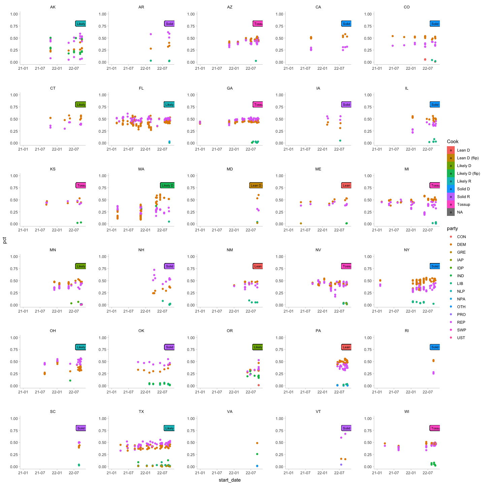
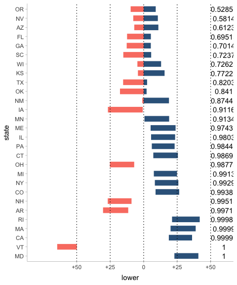
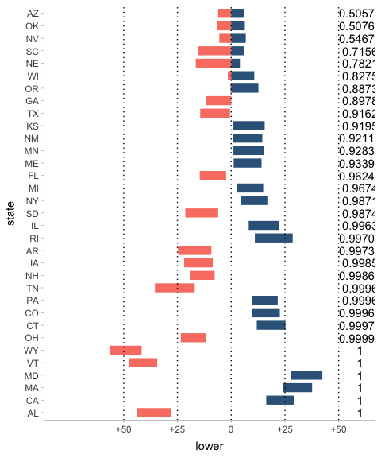
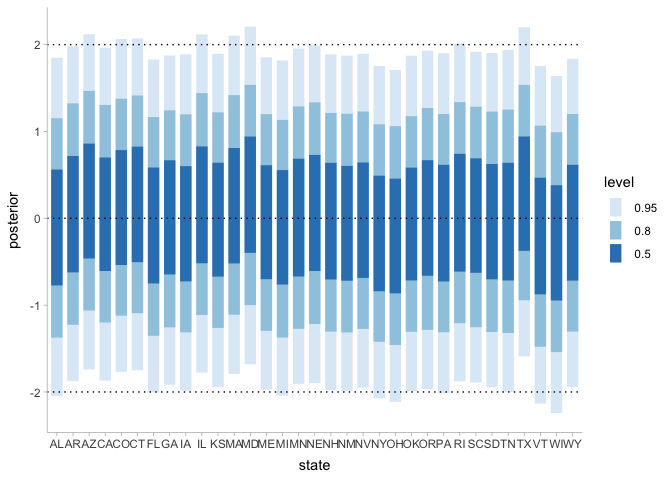
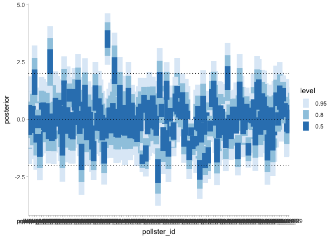
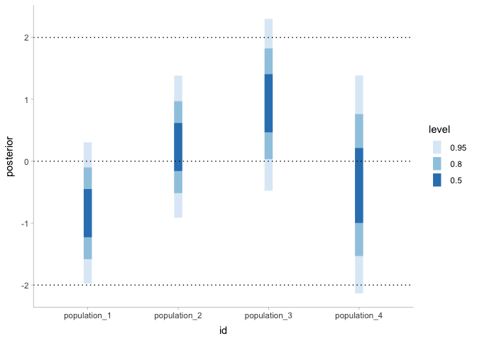
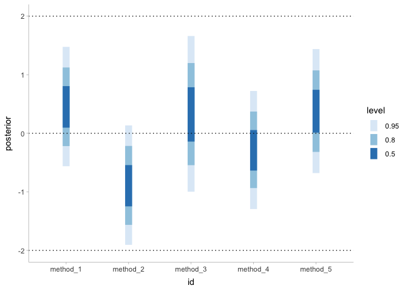

Forecasting the 2022 Governor Elections
================
October 02, 2022

# Settings

``` r
library(tidyverse, quietly = TRUE)
library(ggdist, quietly = TRUE)
library(jsonlite, quietly = TRUE)
library(magrittr, quietly = TRUE)
library(boot, quietly = TRUE)
library(ggpubr, quietly = TRUE)

library(readxl, quietly = TRUE) # read data
library(lubridate, quietly = TRUE) # date
library(parsedate, quietly = TRUE)
library(readr, quietly = TRUE) # csv    
library(usdata, quietly = TRUE) # state names
library(RColorBrewer, quietly = TRUE)
library(rlang, quietly = TRUE)

library(parallel, quietly = TRUE)
library(rstan, quietly = TRUE)
library(tidybayes, quietly = TRUE)
library(cmdstanr, quietly = TRUE)
```

    ## Warning: package 'cmdstanr' was built under R version 4.3.0

``` r
library(bayesplot, quietly = TRUE)
library(vecsets, quietly = TRUE)

FLAG_RUN_MODEL <- T

options(max.print = 10000) 
```

``` r
date <- Sys.Date()

election_day <- ymd('2022-11-08')  

target_day <- election_day #min(date, election_day)

path <- paste0('../../EVA-midterm/midterm-web/public/forecasts/', date)

d_fte <- read_csv('data/fivethirtyeight-9.1.csv') %>% select(state, rep.name, dem.name)

dir.create(path)
```

    ## Warning in dir.create(path): '../../EVA-midterm/midterm-web/public/forecasts/
    ## 2022-10-02' already exists

# Theme set

``` r
theme_set(theme_ggdist() + 
          theme(strip.background = element_blank(),
                panel.spacing = unit(2, "lines"),
                plot.title = element_text(hjust = .5)))

set.seed(1001)
```

``` r
all_states <- c("AK", "AL", "AR", "AZ", "CA", "CO", "CT", "DC", "DE", "FL", "GA", "HI",
            "IA", "ID", "IL", "IN", "KS", "KY", "LA", "MA", "MD", "ME", "MI", "MN", "MO", "MS", "MT",
            "NC", "ND", "NE", "NH", "NJ", "NM", "NV", "NY", "OH", "OK", "OR", "PA", "RI", "SC", "SD", 
            "TN", "TX", "UT", "VA", "VT", "WA", "WI", "WV", "WY")
```

# Load data from fivethirtyeight

``` r
today <- Sys.Date()

current_polls <- read_csv('https://projects.fivethirtyeight.com/polls/data/governor_polls.csv')
```

    ## Rows: 1969 Columns: 42
    ## ── Column specification ────────────────────────────────────────────────────────
    ## Delimiter: ","
    ## chr (23): pollster, sponsors, display_name, pollster_rating_name, fte_grade,...
    ## dbl (12): poll_id, pollster_id, pollster_rating_id, sponsor_candidate_id, qu...
    ## lgl  (6): subpopulation, tracking, internal, seat_name, nationwide_batch, ra...
    ## 
    ## ℹ Use `spec()` to retrieve the full column specification for this data.
    ## ℹ Specify the column types or set `show_col_types = FALSE` to quiet this message.

``` r
# Ratings from Cook report
current_status <- read_xlsx('./data/June_29.xlsx', sheet = 'June_29_states') %>% 
  rename(state_full = State) %>% 
  filter(state_full != 'Northern Mariana Islands') %>% 
  mutate(state = state2abbr(state_full))

current_rate <- read_xlsx('./data/June_29.xlsx', sheet = 'June_29_rate') %>% 
  rename(state_full = State) %>% 
  mutate(state = state2abbr(state_full))

head(current_polls)
```

    ## # A tibble: 6 × 42
    ##   poll_id pollster_id pollster        sponsor_ids sponsors          display_name
    ##     <dbl>       <dbl> <chr>                 <dbl> <chr>             <chr>       
    ## 1   80881        1250 Trafalgar Group          NA <NA>              Trafalgar G…
    ## 2   80881        1250 Trafalgar Group          NA <NA>              Trafalgar G…
    ## 3   80881        1250 Trafalgar Group          NA <NA>              Trafalgar G…
    ## 4   80845         383 PPP                      NA <NA>              Public Poli…
    ## 5   80845         383 PPP                      NA <NA>              Public Poli…
    ## 6   80884         147 Fabrizio               1804 People Who Play … Fabrizio, L…
    ## # … with 36 more variables: pollster_rating_id <dbl>,
    ## #   pollster_rating_name <chr>, fte_grade <chr>, methodology <chr>,
    ## #   state <chr>, start_date <chr>, end_date <chr>, sponsor_candidate_id <dbl>,
    ## #   sponsor_candidate <chr>, sponsor_candidate_party <chr>, question_id <dbl>,
    ## #   sample_size <dbl>, population <chr>, subpopulation <lgl>,
    ## #   population_full <chr>, tracking <lgl>, created_at <chr>, notes <chr>,
    ## #   url <chr>, source <dbl>, internal <lgl>, partisan <chr>, race_id <dbl>, …

``` r
head(current_status)
```

    ## # A tibble: 6 × 9
    ##   state_full  Governor Party `First elected` last_dem last_rep Status Candidates
    ##   <chr>       <chr>    <chr> <chr>              <dbl>    <dbl> <chr>  <chr>     
    ## 1 Arkansas    Asa Hut… Repu… 2014               0.318    0.653 Term-… "William …
    ## 2 Tennessee   Bill Lee Repu… 2018               0.386    0.596 Runni… "Carnita …
    ## 3 Idaho       Brad Li… Repu… 2018               0.382    0.598 Renom… "Ammon Bu…
    ## 4 Georgia     Brian K… Repu… 2018               0.488    0.502 Renom… "Stacey A…
    ## 5 Massachuse… Charlie… Repu… 2014               0.331    0.666 Retir… "Geoff Di…
    ## 6 New Hampsh… Chris S… Repu… 2016               0.334    0.651 Runni… "Julian A…
    ## # … with 1 more variable: state <chr>

``` r
head(current_rate)
```

    ## # A tibble: 6 × 11
    ##   state_full PVI   Incumbent `Last race` Cook  IE    Sabato Politico RCP   Fox  
    ##   <chr>      <chr> <chr>     <chr>       <chr> <chr> <chr>  <chr>    <chr> <chr>
    ## 1 Alabama    R+15  Kay Ivey  59.5% R     Soli… Soli… Safe R Solid R  Safe… Soli…
    ## 2 Alaska     R+9   Mike Dun… 51.4% R     Like… Soli… Likel… Likely R Like… Like…
    ## 3 Arizona    R+3   Doug Duc… 56.0% R     Toss… Toss… Tossup Tossup   Toss… Toss…
    ## 4 Arkansas   R+16  Asa Hutc… 65.3% R     Soli… Soli… Safe R Solid R  Safe… Soli…
    ## 5 California D+14  Gavin Ne… 61.9% D     Soli… Soli… Safe D Solid D  Safe… Soli…
    ## 6 Colorado   D+3   Jared Po… 53.4% D     Soli… Soli… Likel… Likely D Lean… Like…
    ## # … with 1 more variable: state <chr>

``` r
head(current_polls %>% 
  mutate(t = ymd(parse_date(start_date))))
```

    ## # A tibble: 6 × 43
    ##   poll_id pollster_id pollster        sponsor_ids sponsors          display_name
    ##     <dbl>       <dbl> <chr>                 <dbl> <chr>             <chr>       
    ## 1   80881        1250 Trafalgar Group          NA <NA>              Trafalgar G…
    ## 2   80881        1250 Trafalgar Group          NA <NA>              Trafalgar G…
    ## 3   80881        1250 Trafalgar Group          NA <NA>              Trafalgar G…
    ## 4   80845         383 PPP                      NA <NA>              Public Poli…
    ## 5   80845         383 PPP                      NA <NA>              Public Poli…
    ## 6   80884         147 Fabrizio               1804 People Who Play … Fabrizio, L…
    ## # … with 37 more variables: pollster_rating_id <dbl>,
    ## #   pollster_rating_name <chr>, fte_grade <chr>, methodology <chr>,
    ## #   state <chr>, start_date <chr>, end_date <chr>, sponsor_candidate_id <dbl>,
    ## #   sponsor_candidate <chr>, sponsor_candidate_party <chr>, question_id <dbl>,
    ## #   sample_size <dbl>, population <chr>, subpopulation <lgl>,
    ## #   population_full <chr>, tracking <lgl>, created_at <chr>, notes <chr>,
    ## #   url <chr>, source <dbl>, internal <lgl>, partisan <chr>, race_id <dbl>, …

## data clean

``` r
df_polls_0 <- current_polls %>%
  filter(cycle == 2022 &
         stage == 'general') %>% 
  rename(state_full = state) %>%
  mutate(
         pct = pct / 100,
         # state name to abbr
         state = state2abbr(state_full),
         # clean up date
         start_date = mdy(start_date),
         end_date =  mdy(end_date)) %>% 
  filter(start_date >= ymd('2020-12-01'))


min_date = min(df_polls_0$start_date)

df_polls_1 <- df_polls_0 %>%
         mutate(date = round((start_date  - min_date + end_date  - min_date) / 2),
         # clean up
         methodology =  replace_na(methodology, 'unknown'),
         fte_grade =  replace_na(fte_grade, 'unknown')) %>% 
  dplyr::select(
    date,
    state,
    answer,
    candidate_name, 
    party,
    sample_size,
    pct,
    poll_id,
    pollster_id,
    question_id,
    pollster,
    display_name,
    fte_grade,
    methodology,
    population,
    state_full,
    start_date,
    end_date,
    url
  )


max_date = today

head(df_polls_1, n = 10)
```

    ## # A tibble: 10 × 19
    ##    date  state answer candidate_name party sample_size   pct poll_id pollster_id
    ##    <drt> <chr> <chr>  <chr>          <chr>       <dbl> <dbl>   <dbl>       <dbl>
    ##  1 635 … MI    Whitm… Gretchen Whit… DEM          1075 0.509   80881        1250
    ##  2 635 … MI    Dixon  Tudor M. Dixon REP          1075 0.451   80881        1250
    ##  3 635 … MI    Buzuma Mary Buzuma    LIB          1075 0.026   80881        1250
    ##  4 636 … WI    Evers  Tony Evers     DEM           574 0.48    80845         383
    ##  5 636 … WI    Miche… Tim Michels    REP           574 0.46    80845         383
    ##  6 635 … IL    Pritz… J.B. Pritzker  DEM           800 0.48    80884         147
    ##  7 635 … IL    Bailey Darren Bailey  REP           800 0.4     80884         147
    ##  8 635 … IL    Schlu… Scott Schluter LIB           800 0.03    80884         147
    ##  9 635 … IL    Pritz… J.B. Pritzker  DEM           800 0.5     80884         147
    ## 10 635 … IL    Bailey Darren Bailey  REP           800 0.45    80884         147
    ## # … with 10 more variables: question_id <dbl>, pollster <chr>,
    ## #   display_name <chr>, fte_grade <chr>, methodology <chr>, population <chr>,
    ## #   state_full <chr>, start_date <date>, end_date <date>, url <chr>

``` r
# the number of states we can forecast
length(unique(df_polls_1$state))
```

    ## [1] 30

``` r
# transform cook report to get incumbency and the last election dem pct
current_status_short <-
  current_status %>% 
  rename(party = Party) %>% 
  mutate(incumbent_party = recode(party, 'Democratic' = 'DEM', 'Republican' = 'REP', 'DFL' = 'DFL')) %>% 
  mutate(last_dem = last_dem / (last_dem + last_rep) ) 
  
# attach cook report to polling data  
df_polls <-
  df_polls_1 %>% 
  left_join(current_status_short %>% dplyr::select(state, Status, last_dem, incumbent_party), by = 'state') %>% 
  left_join(current_rate %>% dplyr::select(state, Cook), by = 'state') %>% 
  rename(incumbent_status = Status) %>% 
  filter(!is.na(state))
```

Let’s first get a sense of the polls

``` r
df_polls %>% 
  ggplot(aes(x = start_date, y = pct)) +
  geom_point(aes(color = party)) + 
  scale_y_continuous(limits = c(0, 1)) + 
  scale_x_date(date_labels = '%y-%m', limits = c(as.Date(min_date), today)) + 
  geom_label(x = today, y = .8, aes(label = Cook, fill = Cook), size = 2.5) +
  facet_wrap(. ~ state, ncol = 5, scales = 'free') 
```

    ## Warning: Removed 4 rows containing missing values (geom_label).

<!-- -->

## clean up and keep two party parts

We assume that all Democrat candidates’ ballots will go to the final
Democrat candidate, and all republicans’ tickets will go to the final
Republican candidate. This is an assumption that may not always be true.

We also discard other party candidates and their ballots. In some states
like Alaska and New Mexicon, the third-party candidate is quite
compelling.

A poll may have multiple questions. We assume that each question is a
small poll.

``` r
df_polls_two_party <- df_polls %>% 
  # These questions ask IND
  filter(question_id != 148891 & question_id != 162710) %>%
  filter(state != 'AK') %>% 
  group_by(question_id, party) %>% 
  summarise(grouped_pct = sum(pct), 
    date,
    state,
    sample_size,
    poll_id,
    pollster_id,
    question_id,
    pollster,
    display_name,
    fte_grade,
    methodology,
    population,
    state_full,
    start_date,
    incumbent_status,
    incumbent_party,
    last_dem,
    url
  ) %>%  
  distinct() %>% 
  spread(
    key = party, 
    value = grouped_pct
  ) %>% 
  mutate(
         n_dem = DEM * sample_size,
         n_rep = REP * sample_size,
         n_two_party =  round(n_dem + n_rep),
         dem_pct = n_dem / n_two_party,
         rep_pct = 1 - dem_pct,
         dem_num = round(dem_pct * n_two_party),
         date_index = round(as.numeric(date)),
         question_id = as.factor(question_id),
         poll_id = as.factor(poll_id),
         pollster_id = as.factor(pollster_id),
         last_dem_logit = logit(last_dem),
         methodology_recode = recode(
           methodology,
           "Online" = "Online",
           "Live Phone" = "Live Phone",
           "IVR" = "IVR",
           "unknown" = "unknown", 
           .default = "mixed"
         ),
         methodology_recode = as.factor(methodology_recode),
         population = as.factor(population)
         ) %>% 
  dplyr::select(n_two_party, 
                  dem_pct, rep_pct, 
                  dem_num, date_index, 
                  question_id, 
                  poll_id, 
                  pollster_id, 
                  pollster,
                  display_name,
                  methodology_recode,
                  population,
                  date, 
                  start_date,
                  state,
                  url,
                  incumbent_party,
                  last_dem) %>% 
  arrange(date) 
```

    ## `summarise()` has grouped output by 'question_id', 'party'. You can override
    ## using the `.groups` argument.

``` r
states <- unique(df_polls_two_party$state)

# check if there is NA
if(nrow(na.omit(df_polls_two_party)) != nrow(df_polls_two_party)) quit(save="ask")
```

## look at the data after clean-up

``` r
df_polls_two_party %>% 
  ggplot() +
  geom_line(mapping = aes(x = start_date, y = dem_pct), color = 'steelblue') + 
  geom_point(mapping = aes(x = start_date, y = dem_pct), size = 1, color = 'steelblue') + 
  geom_line(mapping = aes(x = start_date, y = rep_pct), color = 'salmon') +
  geom_point(mapping = aes(x = start_date, y = rep_pct), size = 1, color = 'salmon') + 
  geom_hline(yintercept = .5, color = 'gray', linetype = 'dashed') + 
  scale_y_continuous(limits = c(0, 1)) + 
  scale_x_date(date_labels = '%y-%m', limits = c(as.Date(min_date), today)) + 
  facet_wrap(. ~ state, ncol = 5, scales = 'free') 
```

<!-- -->

Let’s check how many polls we have for a state

``` r
df_polls_two_party %>%  
  group_by(state) %>% 
  summarise(n())
```

    ## # A tibble: 28 × 2
    ##    state `n()`
    ##    <chr> <int>
    ##  1 AR        4
    ##  2 AZ       30
    ##  3 CA        7
    ##  4 CO       13
    ##  5 CT        9
    ##  6 FL       74
    ##  7 GA       49
    ##  8 IA        4
    ##  9 IL       15
    ## 10 KS        6
    ## # … with 18 more rows

# Modeling preparation

# Model

## stan code

``` r
m5_stan ="
data{
  int N_questions;   
  int N_polls;    
  int N_days;   
  int N_states;  
  int N_pollsters;    
  int N_population;
  int N_methods; 
  int direction_flag;
  
  array[N_questions] int<lower = 1, upper = N_states> state_index; // State index
  array[N_questions] int<lower = 1, upper = N_days>  day_state_index;   // Day index
  
  array[N_questions] int<lower = 1, upper = N_polls>  poll_index; // poll index
  array[N_questions] int<lower = 1, upper = N_pollsters> pollster_index; // which pollster
  array[N_questions] int<lower = 1, upper = N_methods> methods_index;   // which polling method
  array[N_questions] int<lower = 1, upper = N_population> population_index;   // which method

  vector[N_states] last_dem_logit;   // which incumbency party in that state?
 
  array[N_questions] int dem_num;
  array[N_questions] int n_two_party;
  
  real state_day_sigma_scaler;
  real states_poll_bias_scaler;
  real sigma_scaler_pollster;
  real sigma_scaler;
}

parameters {
  
  vector[N_pollsters] mu_pollster; 
  vector[N_methods] mu_methods; 
  vector[N_population] mu_population; 
  
  vector[N_polls] poll_noise;
  vector[N_states] polling_bias_states;  
  
  matrix[N_states, N_days] err;
  vector[N_states] raw_mu_first_day;

}

transformed parameters {
 

  matrix[N_states,N_days] mu; 

  // this is forward
  if(direction_flag > 0){
    
    mu[:, 1] = raw_mu_first_day;
    
    for (t in 2:N_days) {
      mu[:, t] = mu[:,  t - 1] + err[:, t] * state_day_sigma_scaler;
    }
    
  }else{
    // this is backward
    mu[:, N_days] = raw_mu_first_day;
    
    for (t in 1:(N_days-1)) {
      mu[:, N_days - t] = mu[:,  N_days - t + 1] + err[:, N_days - t + 1] * state_day_sigma_scaler;
    }
  }


 vector[N_questions] logit_dem_pct;  

 for (i in 1:N_questions){
   logit_dem_pct[i] =
    mu[state_index[i], day_state_index[i]] + 
    mu_pollster[pollster_index[i]] * sigma_scaler_pollster + 
   // mu_incumbent_party[incumbent_party_index[state_index[i]]] * sigma_scaler + 
    mu_methods[methods_index[i]] * sigma_scaler +
    mu_population[population_index[i]] * sigma_scaler + 
    polling_bias_states[state_index[i]] * states_poll_bias_scaler + 
    poll_noise[poll_index[i]] * sigma_scaler;
 }

}

model {

  mu_pollster ~ std_normal();
  //mu_incumbent_party ~ std_normal();
  mu_methods ~ std_normal();
  mu_population ~ std_normal();
  poll_noise ~  std_normal();
  polling_bias_states ~  std_normal();
  raw_mu_first_day ~ normal(last_dem_logit, .3); 
  
  to_vector(err) ~  std_normal();

  dem_num ~ binomial_logit(n_two_party, logit_dem_pct);
  
}

"

if(exists('out')) rm(out)
if(exists('df_prediction')) rm(df_prediction)
if(exists('prediction')) rm(prediction)
if(exists('df_mu_methods')) rm(df_mu_methods)
if(exists('df_poll_noise')) rm(df_poll_noise)

f <- write_stan_file(code = m5_stan, dir = 'stan', basename = 'm5.stan')
```

## transform data to pass to stan

``` r
df_polls_two_party <-
  df_polls_two_party %>% 
  ungroup() %>% 
  mutate(state_index = as.numeric(as.factor(state)),
         day_state_index = as.integer(date) + 1,
         day = min_date + date, 
         pollster_index = as.numeric(as.factor(pollster_id)),
         poll_index = as.numeric(as.factor(poll_id)),
         methods_index = as.numeric(as.factor(methodology_recode)),
         population_index = as.numeric(as.factor(population)),
         incumbent_party_index = as.numeric(as.factor(incumbent_party))
         )

states <- levels(as.factor(df_polls_two_party$state))
```

## pass data to stan

``` r
pulled_incumbent_party_index <- df_polls_two_party %>% 
                                dplyr::select(c(state_index, incumbent_party_index)) %>% 
                                arrange(state_index) %>% distinct() %>% pull(incumbent_party_index)


pulled_last_dem_logit <- logit(df_polls_two_party %>% 
                                dplyr::select(c(state_index, last_dem)) %>% 
                                arrange(state_index) %>% distinct() %>% pull(last_dem))

sigma_scaler = 0.04 
sigma_scaler_pollster = 0.06

state_day_sigma_scaler = 0.016
# 0.0165 from the economist's 2020 presidential election
# 0.032 if we want to double it

states_poll_bias_scaler = .076
# .076 result in +- in total 0.07585401
# 0.15 if we want to double it
# 0.2 if we want to make 20

# we use the forward model
direction_flag = 1

m5_data = list( 
  sigma_scaler = sigma_scaler,
  sigma_scaler_pollster = sigma_scaler_pollster,
  state_day_sigma_scaler = state_day_sigma_scaler, 
  states_poll_bias_scaler = states_poll_bias_scaler,
  direction_flag = direction_flag,
  # states_sd_scaler = states_sigma_scaler,
  # states_sd_scaler = sd_rough$sd_scaler,
  # states_avg_sigma = states_avg_sigma,
  N_questions = length(unique(df_polls_two_party$question_id)),
  N_polls = length(unique(df_polls_two_party$poll_index)),
  N_days = as.integer(round(difftime(election_day, min_date))) + 1,
  N_states = length(unique(df_polls_two_party$state_index)),
  N_pollsters = length(unique(df_polls_two_party$pollster_index)),
  N_population = length(unique(df_polls_two_party$population_index)),
  N_methods = length(unique(df_polls_two_party$methods_index)),
  N_incumbent_party = length(unique(df_polls_two_party$incumbent_party)),
    
  state_index = df_polls_two_party$state_index,
  day_state_index = df_polls_two_party$day_state_index,
  pollster_index = df_polls_two_party$pollster_index,
  poll_index = df_polls_two_party$poll_index,
  methods_index = df_polls_two_party$methods_index,
  population_index = df_polls_two_party$population_index,
  incumbent_party_index = pulled_incumbent_party_index,
    
  dem_num = df_polls_two_party$dem_num,
  n_two_party = df_polls_two_party$n_two_party,
  last_dem_logit = pulled_last_dem_logit
)
```

## model fit

``` r
if (FLAG_RUN_MODEL) {
  
   if (file.exists("stan/m5")) {
      file.remove("stan/m5")
   }
  
  m5 <- cmdstanr::cmdstan_model('stan/m5.stan',
                            compile = TRUE,
                            force = TRUE
                            #force_recompile = TRUE,
                            #https://rdrr.io/github/stan-dev/cmdstanr/src/R/model.R
                            #stanc_options = list("auto-format")
                           )
  
  print(m5)
  #print(m5_data)
  
  fit <- m5$sample(
    data = m5_data,
    seed = 99,
    parallel_chains = MCMC_SETTINGS$N_CHAINS, 
    chains = MCMC_SETTINGS$N_CHAINS,
    iter_warmup = MCMC_SETTINGS$N_WARMUP,
    iter_sampling = MCMC_SETTINGS$N_WARMUP,
    refresh = MCMC_SETTINGS$N_WARMUP * .2,
    max_treedepth = MCMC_SETTINGS$TREE_DEPTH,
    adapt_delta = MCMC_SETTINGS$DELTA,
    init = 0
  )
  
  fit$cmdstan_diagnose()
  #fit$cmdstan_summary()
  

  out <- rstan::read_stan_csv(fit$output_files())
  
  
  # save model
  write_rds(out, sprintf('rds/out_%s.rds', date), compress = 'gz')
  
  write_rds(fit, sprintf('rds/fit_%s.rds', date), compress = 'gz')
  
  rm(fit)
  gc(full = T)
  
} else {
  out <- read_rds(sprintf('rds/out_%s.rds', date))
}
```

    ## 
    ## data{
    ##   int N_questions;   
    ##   int N_polls;    
    ##   int N_days;   
    ##   int N_states;  
    ##   int N_pollsters;    
    ##   int N_population;
    ##   int N_methods; 
    ##   int direction_flag;
    ##   
    ##   array[N_questions] int<lower = 1, upper = N_states> state_index; // State index
    ##   array[N_questions] int<lower = 1, upper = N_days>  day_state_index;   // Day index
    ##   
    ##   array[N_questions] int<lower = 1, upper = N_polls>  poll_index; // poll index
    ##   array[N_questions] int<lower = 1, upper = N_pollsters> pollster_index; // which pollster
    ##   array[N_questions] int<lower = 1, upper = N_methods> methods_index;   // which polling method
    ##   array[N_questions] int<lower = 1, upper = N_population> population_index;   // which method
    ## 
    ##   vector[N_states] last_dem_logit;   // which incumbency party in that state?
    ##  
    ##   array[N_questions] int dem_num;
    ##   array[N_questions] int n_two_party;
    ##   
    ##   real state_day_sigma_scaler;
    ##   real states_poll_bias_scaler;
    ##   real sigma_scaler_pollster;
    ##   real sigma_scaler;
    ## }
    ## 
    ## parameters {
    ##   
    ##   vector[N_pollsters] mu_pollster; 
    ##   vector[N_methods] mu_methods; 
    ##   vector[N_population] mu_population; 
    ##   
    ##   vector[N_polls] poll_noise;
    ##   vector[N_states] polling_bias_states;  
    ##   
    ##   matrix[N_states, N_days] err;
    ##   vector[N_states] raw_mu_first_day;
    ## 
    ## }
    ## 
    ## transformed parameters {
    ##  
    ## 
    ##   matrix[N_states,N_days] mu; 
    ## 
    ##   // this is forward
    ##   if(direction_flag > 0){
    ##     
    ##     mu[:, 1] = raw_mu_first_day;
    ##     
    ##     for (t in 2:N_days) {
    ##       mu[:, t] = mu[:,  t - 1] + err[:, t] * state_day_sigma_scaler;
    ##     }
    ##     
    ##   }else{
    ##     // this is backward
    ##     mu[:, N_days] = raw_mu_first_day;
    ##     
    ##     for (t in 1:(N_days-1)) {
    ##       mu[:, N_days - t] = mu[:,  N_days - t + 1] + err[:, N_days - t + 1] * state_day_sigma_scaler;
    ##     }
    ##   }
    ## 
    ## 
    ## 
    ##  vector[N_questions] logit_dem_pct;  
    ## 
    ##  for (i in 1:N_questions){
    ##    logit_dem_pct[i] =
    ##     mu[state_index[i], day_state_index[i]] + 
    ##     mu_pollster[pollster_index[i]] * sigma_scaler_pollster + 
    ##    // mu_incumbent_party[incumbent_party_index[state_index[i]]] * sigma_scaler + 
    ##     mu_methods[methods_index[i]] * sigma_scaler +
    ##     mu_population[population_index[i]] * sigma_scaler + 
    ##     polling_bias_states[state_index[i]] * states_poll_bias_scaler + 
    ##     poll_noise[poll_index[i]] * sigma_scaler;
    ##  }
    ## 
    ## }
    ## 
    ## model {
    ## 
    ##   mu_pollster ~ std_normal();
    ##   //mu_incumbent_party ~ std_normal();
    ##   mu_methods ~ std_normal();
    ##   mu_population ~ std_normal();
    ##   poll_noise ~  std_normal();
    ##   polling_bias_states ~  std_normal();
    ##   raw_mu_first_day ~ normal(last_dem_logit, .3); 
    ##   
    ##   to_vector(err) ~  std_normal();
    ## 
    ##   dem_num ~ binomial_logit(n_two_party, logit_dem_pct);
    ##   
    ## }
    ## 
    ## 
    ## Running MCMC with 4 parallel chains...
    ## 
    ## Chain 1 Iteration:    1 / 10000 [  0%]  (Warmup) 
    ## Chain 2 Iteration:    1 / 10000 [  0%]  (Warmup) 
    ## Chain 3 Iteration:    1 / 10000 [  0%]  (Warmup) 
    ## Chain 4 Iteration:    1 / 10000 [  0%]  (Warmup) 
    ## Chain 3 Iteration: 1000 / 10000 [ 10%]  (Warmup) 
    ## Chain 2 Iteration: 1000 / 10000 [ 10%]  (Warmup) 
    ## Chain 4 Iteration: 1000 / 10000 [ 10%]  (Warmup) 
    ## Chain 1 Iteration: 1000 / 10000 [ 10%]  (Warmup) 
    ## Chain 2 Iteration: 2000 / 10000 [ 20%]  (Warmup) 
    ## Chain 4 Iteration: 2000 / 10000 [ 20%]  (Warmup) 
    ## Chain 3 Iteration: 2000 / 10000 [ 20%]  (Warmup) 
    ## Chain 1 Iteration: 2000 / 10000 [ 20%]  (Warmup) 
    ## Chain 2 Iteration: 3000 / 10000 [ 30%]  (Warmup) 
    ## Chain 4 Iteration: 3000 / 10000 [ 30%]  (Warmup) 
    ## Chain 3 Iteration: 3000 / 10000 [ 30%]  (Warmup) 
    ## Chain 1 Iteration: 3000 / 10000 [ 30%]  (Warmup) 
    ## Chain 2 Iteration: 4000 / 10000 [ 40%]  (Warmup) 
    ## Chain 4 Iteration: 4000 / 10000 [ 40%]  (Warmup) 
    ## Chain 3 Iteration: 4000 / 10000 [ 40%]  (Warmup) 
    ## Chain 1 Iteration: 4000 / 10000 [ 40%]  (Warmup) 
    ## Chain 2 Iteration: 5000 / 10000 [ 50%]  (Warmup) 
    ## Chain 2 Iteration: 5001 / 10000 [ 50%]  (Sampling) 
    ## Chain 4 Iteration: 5000 / 10000 [ 50%]  (Warmup) 
    ## Chain 4 Iteration: 5001 / 10000 [ 50%]  (Sampling) 
    ## Chain 3 Iteration: 5000 / 10000 [ 50%]  (Warmup) 
    ## Chain 3 Iteration: 5001 / 10000 [ 50%]  (Sampling) 
    ## Chain 1 Iteration: 5000 / 10000 [ 50%]  (Warmup) 
    ## Chain 1 Iteration: 5001 / 10000 [ 50%]  (Sampling) 
    ## Chain 2 Iteration: 6000 / 10000 [ 60%]  (Sampling) 
    ## Chain 4 Iteration: 6000 / 10000 [ 60%]  (Sampling) 
    ## Chain 3 Iteration: 6000 / 10000 [ 60%]  (Sampling) 
    ## Chain 1 Iteration: 6000 / 10000 [ 60%]  (Sampling) 
    ## Chain 2 Iteration: 7000 / 10000 [ 70%]  (Sampling) 
    ## Chain 4 Iteration: 7000 / 10000 [ 70%]  (Sampling) 
    ## Chain 3 Iteration: 7000 / 10000 [ 70%]  (Sampling) 
    ## Chain 1 Iteration: 7000 / 10000 [ 70%]  (Sampling) 
    ## Chain 2 Iteration: 8000 / 10000 [ 80%]  (Sampling) 
    ## Chain 3 Iteration: 8000 / 10000 [ 80%]  (Sampling) 
    ## Chain 4 Iteration: 8000 / 10000 [ 80%]  (Sampling) 
    ## Chain 1 Iteration: 8000 / 10000 [ 80%]  (Sampling) 
    ## Chain 2 Iteration: 9000 / 10000 [ 90%]  (Sampling) 
    ## Chain 3 Iteration: 9000 / 10000 [ 90%]  (Sampling) 
    ## Chain 4 Iteration: 9000 / 10000 [ 90%]  (Sampling) 
    ## Chain 1 Iteration: 9000 / 10000 [ 90%]  (Sampling) 
    ## Chain 2 Iteration: 10000 / 10000 [100%]  (Sampling) 
    ## Chain 2 finished in 2007.6 seconds.
    ## Chain 3 Iteration: 10000 / 10000 [100%]  (Sampling) 
    ## Chain 4 Iteration: 10000 / 10000 [100%]  (Sampling) 
    ## Chain 3 finished in 2012.8 seconds.
    ## Chain 4 finished in 2013.0 seconds.
    ## Chain 1 Iteration: 10000 / 10000 [100%]  (Sampling) 
    ## Chain 1 finished in 2013.9 seconds.
    ## 
    ## All 4 chains finished successfully.
    ## Mean chain execution time: 2011.8 seconds.
    ## Total execution time: 2014.0 seconds.
    ## 
    ## Processing csv files: /var/folders/jp/wsnh83jx57n8xfxhw1wwtcgh0000gn/T/RtmpTM1OaC/m5-202210021845-1-90144e.csv, /var/folders/jp/wsnh83jx57n8xfxhw1wwtcgh0000gn/T/RtmpTM1OaC/m5-202210021845-2-90144e.csv, /var/folders/jp/wsnh83jx57n8xfxhw1wwtcgh0000gn/T/RtmpTM1OaC/m5-202210021845-3-90144e.csv, /var/folders/jp/wsnh83jx57n8xfxhw1wwtcgh0000gn/T/RtmpTM1OaC/m5-202210021845-4-90144e.csv
    ## 
    ## Checking sampler transitions treedepth.
    ## Treedepth satisfactory for all transitions.
    ## 
    ## Checking sampler transitions for divergences.
    ## No divergent transitions found.
    ## 
    ## Checking E-BFMI - sampler transitions HMC potential energy.
    ## E-BFMI satisfactory.
    ## 
    ## Effective sample size satisfactory.
    ## 
    ## Split R-hat values satisfactory all parameters.
    ## 
    ## Processing complete, no problems detected.

    ##             used   (Mb) gc trigger    (Mb) limit (Mb)   max used    (Mb)
    ## Ncells   2236745  119.5    3739711   199.8         NA    3739711   199.8
    ## Vcells 787960965 6011.7 1580307966 12056.8  1.024e+12 1425209763 10873.5

## posterior prediction

``` r
prediction <-
  rstan::extract(out, pars = "mu")[[1]]
```

``` r
nX <- MCMC_SETTINGS$N_CHAINS * MCMC_SETTINGS$N_WARMUP
nY <- m5_data$N_states
nZ <- m5_data$N_days

dim(prediction) <- nX * nY * nZ

df_prediction <- tibble(prediction = inv.logit(prediction), 
                   .draw = rep(1:nX, times = nY * nZ),
                   day_index = rep(1:nZ, each = nY * nX),
                   state_index = rep(rep(1:nY, each = nX), times = nZ),
                   day = min_date + day_index - 1,
                   state = states[state_index]
                 )
```

## current day

``` r
prediction_summary <-
  df_prediction %>% 
    group_by(day, state) %>% 
    median_qi(prediction) %>% 
    mutate(diff = .upper - .lower)
```

Let’s check the model prediction for the entire election season

``` r
prediction_summary %>% 
  ggplot() + 
    geom_lineribbon(
      aes(
      x = day,
      y = prediction,
      ymin = .lower,
      ymax = .upper
    ),
    fill = 'lightgray',
    size = 1
    ) +
  geom_point(
    df_polls_two_party,
    mapping = aes(x = day, y = dem_pct)
  ) + 
  geom_hline(df_polls_two_party %>% select(state, last_dem) %>% distinct(),
             mapping = aes(yintercept = last_dem), linetype = 'dotted', color = 'purple', size = .8) + 
  geom_vline(xintercept = today, linetype = 'dotted') + 
  geom_hline(yintercept = 0.5, linetype = 'dotted', size = .8) + 
  facet_wrap(state ~ ., ncol = 5, scale = 'free_x')
```

<!-- -->

Get summary on election day

``` r
election_day_prediction <- df_prediction %>%
  filter(day == target_day) %>% 
  rename(dem = prediction) %>% 
  mutate(rep = 1 - dem) %>% 
  group_by(state) 

election_day_prediction %>% 
  mean_qi(dem, rep, .width = .95) 
```

    ## # A tibble: 28 × 10
    ##    state   dem dem.lower dem.upper   rep rep.lower rep.upper .width .point
    ##    <chr> <dbl>     <dbl>     <dbl> <dbl>     <dbl>     <dbl>  <dbl> <chr> 
    ##  1 AR    0.395     0.326     0.469 0.605     0.531     0.674   0.95 mean  
    ##  2 AZ    0.510     0.442     0.579 0.490     0.421     0.558   0.95 mean  
    ##  3 CA    0.660     0.585     0.730 0.340     0.270     0.415   0.95 mean  
    ##  4 CO    0.590     0.521     0.655 0.410     0.345     0.479   0.95 mean  
    ##  5 CT    0.582     0.511     0.651 0.418     0.349     0.489   0.95 mean  
    ##  6 FL    0.473     0.404     0.542 0.527     0.458     0.596   0.95 mean  
    ##  7 GA    0.482     0.413     0.551 0.518     0.449     0.587   0.95 mean  
    ##  8 IA    0.431     0.335     0.530 0.569     0.470     0.665   0.95 mean  
    ##  9 IL    0.573     0.503     0.640 0.427     0.360     0.497   0.95 mean  
    ## 10 KS    0.528     0.453     0.603 0.472     0.397     0.547   0.95 mean  
    ## # … with 18 more rows, and 1 more variable: .interval <chr>

``` r
election_summary <- 
  election_day_prediction %>% 
    mean_qi(dem, rep, .width = .8) %>%
    merge(election_day_prediction %>% 
        summarise(prob.dem = mean(dem > .5), prob.rep = mean(1 - dem > .5))) #%>%
```

Show 80% credible intervals and probabilities (like fivethirtyeight)

``` r
election_summary %>% 
  rowwise() %>% 
  mutate(lower = dem.lower,
         lower.end = max(dem.lower, min(.5, dem.upper)),
         upper= dem.upper,
         upper.start = min(dem.upper, max(.5, dem.lower)),
         prob = max(prob.dem, prob.rep),
         diff_prob = abs(prob - .5)) %>%
  arrange(desc(diff_prob)) %>% 
  mutate(state = factor(state, unique(state))) %>% 
  ggplot() + 
  geom_segment(aes(x = lower, xend = lower.end, y = state, yend = state), size = 4, color = 'salmon') +
  geom_segment(aes(x = upper.start, xend = upper, y = state, yend = state), size = 4, color = 'steelblue4') +
  geom_vline(xintercept = c(.25, .375, .5, .625, .75), linetype='dotted') +
  geom_text(x = .8, aes(y = state, label = prob)) + 
  scale_x_continuous(limits = c(.1, .8), breaks = c(.25, .375, .5, .625, .75), labels = c('+50', '+25', '0', '+25', '+50'))
```

<!-- -->

## check other terms

First, let’s look at the polling bias for each state

``` r
polling_bias_states <-
  rstan::extract(out, pars = "polling_bias_states")[[1]]

dim(polling_bias_states) <- nX * m5_data$N_states

df_polling_bias_states <- tibble(
         posterior = polling_bias_states,
         .draw = rep(1:nX, times =  m5_data$N_states),
         state_index = rep(1: m5_data$N_states, each =  nX),
         state = states[state_index]
       ) 

df_polling_bias_states %>% 
    group_by(state) %>% 
    ggplot(aes(x = state, y = posterior)) +
    stat_interval() +
    geom_hline(yintercept=c(0, -2, 2), linetype = 'dotted') + 
    scale_color_brewer() +
    scale_y_continuous()
```

<!-- -->

``` r
# save memory
rm(polling_bias_states)
rm(df_polling_bias_states)
```

also pollster bias

``` r
mu_pollster <-
  rstan::extract(out, pars = "mu_pollster")[[1]]

dim(mu_pollster) <- nX * m5_data$N_pollsters

df_mu_pollster <- tibble(
         posterior = mu_pollster,
         .draw = rep(1:nX, times =  m5_data$N_pollsters),
         pollster_id = paste0('pollster_', rep(1:m5_data$N_pollsters, each = nX))
       ) 

df_mu_pollster %>% 
    group_by(pollster_id) %>% 
    ggplot(aes(x = pollster_id, y = posterior)) +
    stat_interval() +
    geom_hline(yintercept=c(0, -2, 2), linetype = 'dotted') + 
    scale_color_brewer() +
    scale_y_continuous()
```

<!-- -->

``` r
# save memory
rm(mu_pollster)
rm(df_mu_pollster)
```

Also different voter types

``` r
mu_population <-
  rstan::extract(out, pars = "mu_population")[[1]]

dim(mu_population) <- nX * m5_data$N_population

df_mu_population <- tibble(
         posterior = mu_population,
         .draw = rep(1:nX, times =  m5_data$N_population),
         id = paste0('population_', rep(1:m5_data$N_population, each = nX))
       ) %>% 
    group_by(id) 

df_mu_population %>% 
    ggplot(aes(x = id, y = posterior)) +
    stat_interval() +
    geom_hline(yintercept=c(0, -2, 2), linetype = 'dotted') + 
    scale_color_brewer() +
    scale_y_continuous()
```

<!-- -->

``` r
# save memory
rm(mu_population)
rm(df_mu_population)
```

The effects of different polling methods

``` r
mu_methods <-
  rstan::extract(out, pars = "mu_methods")[[1]]

dim(mu_methods) <- nX * m5_data$N_methods

df_mu_methods <- tibble(
         posterior = mu_methods,
         .draw = rep(1:nX, times =  m5_data$N_methods),
         id = paste0('method_', rep(1:m5_data$N_methods, each = nX))
       ) 

df_mu_methods %>% 
    group_by(id) %>% 
    ggplot(aes(x = id, y = posterior)) +
    stat_interval() +
    geom_hline(yintercept=c(0, -2, 2), linetype = 'dotted') + 
    scale_color_brewer() +
    scale_y_continuous()
```

<!-- -->

``` r
# save memory
rm(mu_methods)
rm(df_mu_methods)
```

Each individual poll’s nosie

``` r
poll_noise <-
  rstan::extract(out, pars = "poll_noise")[[1]]

m5_data$N_polls <- m5_data$N_polls 

dim(poll_noise) <- nX * m5_data$N_polls

df_poll_noise <-
tibble(
         posterior = poll_noise,
         .draw = rep(1:nX, times =  m5_data$N_polls),
         id = paste0('polls_', rep(1:m5_data$N_polls, each = nX))
       ) 

df_poll_noise %>% 
    group_by(id) %>% 
    ggplot(aes(x = id, y = posterior)) +
    stat_interval() +
    geom_hline(yintercept=c(0, -2, 2), linetype = 'dotted') + 
    scale_color_brewer() +
    scale_y_continuous()
```

<!-- -->

``` r
# save memory
rm(poll_noise)
rm(df_poll_noise)
```

``` r
# This was used and then found incumbent effect does not matter
mu_incumbent_party <-
  rstan::extract(out, pars = "mu_incumbent_party")[[1]]

dim(mu_incumbent_party) <- nX * m5_data$N_incumbent_party

tibble(
         posterior = mu_incumbent_party,
         .draw = rep(1:nX, times =  m5_data$N_incumbent_party),
         id = paste0('party_', rep(1:m5_data$N_incumbent_party, each = nX))
       ) %>% 
    group_by(id) %>% 
    ggplot(aes(x = id, y = posterior)) +
    stat_interval() +
    geom_hline(yintercept=c(0, -1, 1), linetype = 'dotted') + 
    xlab('incumbent_party') + 
    scale_color_brewer() +
    scale_y_continuous()
```

# To web

``` r
write.csv(election_day_prediction %>% select(.draw, dem, rep, day, state), file = paste0('model-output/', date, '_election_day_prediction.csv'))
```

The following code is used only for generating data for the website. We
omit explanations.

## posterior samples

## ci, density, etc

## prob

## save day summary

## all days’ summary

## get poll info

## sample 100 posterior draws
